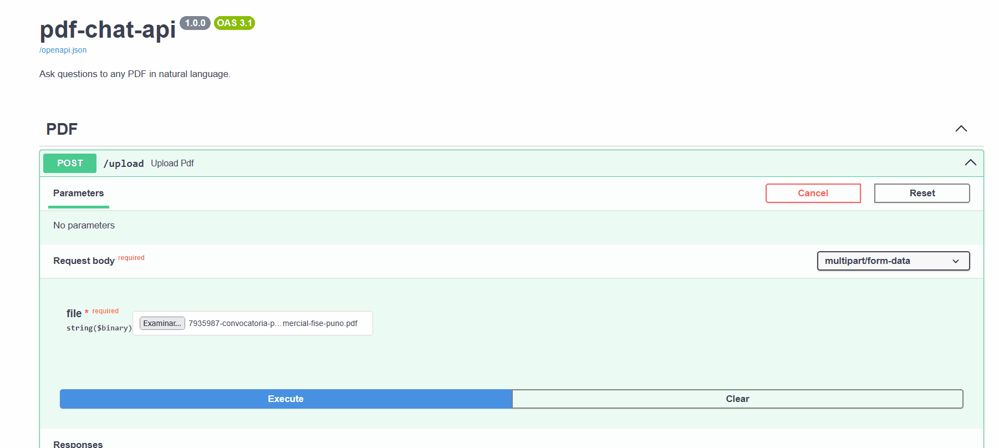

# pdf-chat-api

REST API to ask questions to any PDF in natural language using RAG (Retrieval-Augmented Generation).



---

## How it works

1. Upload a PDF → get a `session_id`
2. Ask questions → the API retrieves relevant chunks via FAISS and answers using an LLM
3. Chat history is maintained per session — follow-up questions work naturally

The PDF is never sent whole to the LLM. Only the 4 most semantically relevant chunks are retrieved for each question.

---

## Stack

- FastAPI · LangChain · FAISS · HuggingFace Embeddings
- LLM: Groq (default) — swappable to OpenAI or Gemini via `.env`

---

## Quickstart

```bash
git clone https://github.com/dairxp/pdf-chat-api
cd pdf-chat-api
python -m venv venv && source venv/bin/activate  # Windows: venv\Scripts\activate
pip install -r requirements.txt
cp .env.example .env  # add your API key
uvicorn app.main:app --reload
```

Interactive docs: `http://localhost:8000/docs`

---

## Endpoints

| Method | Endpoint | Description |
|--------|----------|-------------|
| POST | `/upload` | Upload a PDF, returns `session_id` |
| POST | `/chat/{session_id}` | Ask a question (with chat history) |
| POST | `/chat/{session_id}/stream` | Same, but streams tokens via SSE |
| DELETE | `/session/{session_id}` | Clear session from memory |

### Upload

```bash
curl -X POST http://localhost:8000/upload -F "file=@document.pdf"
# { "session_id": "abc-123", "pages": 12 }
```

### Chat

```bash
curl -X POST http://localhost:8000/chat/abc-123 \
  -H "Content-Type: application/json" \
  -d '{"question": "What is this document about?"}'
# { "answer": "...", "sources": [1, 3] }
```

### Stream (token by token)

```bash
curl -N -X POST http://localhost:8000/chat/abc-123/stream \
  -H "Content-Type: application/json" \
  -d '{"question": "Summarize the document"}'
# data: {"type": "token", "content": "This"}
# data: {"type": "token", "content": " document"}
# data: {"type": "sources", "pages": [1, 3]}
# data: [DONE]
```

---

## Switching LLM provider

```env
# .env

# Groq (default — free)
LLM_PROVIDER=groq
LLM_MODEL=llama-3.1-8b-instant
GROQ_API_KEY=your_key

# OpenAI
LLM_PROVIDER=openai
LLM_MODEL=gpt-3.5-turbo
OPENAI_API_KEY=your_key
```

No code changes needed.

---

## Project structure

```
pdf-chat-api/
├── app/
│   ├── main.py
│   ├── api/routes/        # upload, chat, stream
│   ├── core/config.py     # settings via .env
│   ├── services/
│   │   ├── pdf_service.py      # PDF extraction + FAISS indexing
│   │   ├── chat_service.py     # QA chain + streaming
│   │   ├── session_store.py    # in-memory session management
│   │   └── llm_factory.py      # provider switching
│   └── models/schemas.py
├── .env.example
├── Dockerfile
└── requirements.txt
```

---

> Developed by [dairxp](https://github.com/dairxp)
